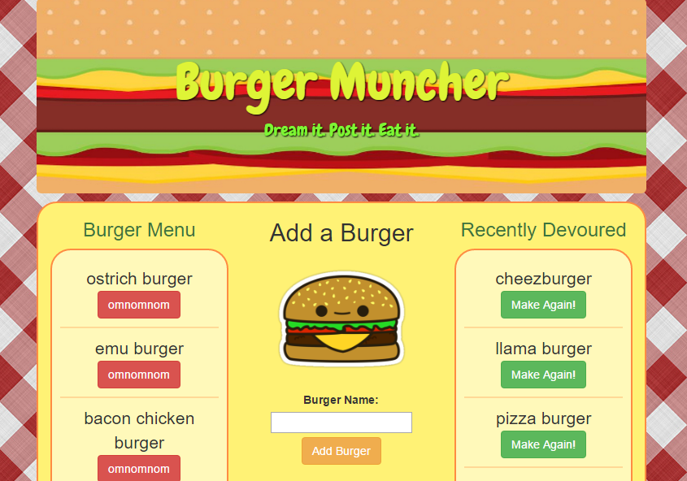

# Burger Muncher

This version of Burger Muncher uses MySQL, Node, Express, and Handlebars.

Users can create a burger using the submit button in the middle of the page

As users create burgers, they are added to the Burger Menu on the left side of the page.

As burgers are nommed, they are moved to the Recently Devoured menu on the right.

This project makes me hungry.

